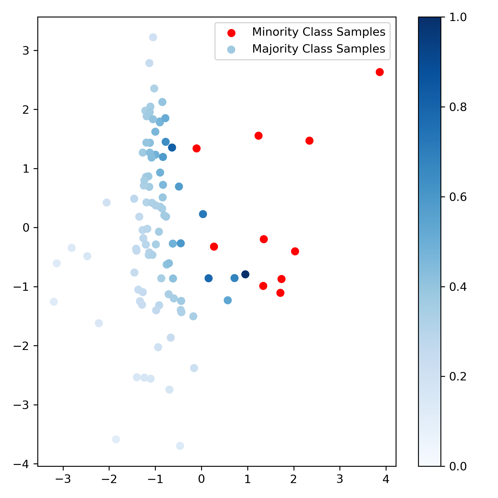
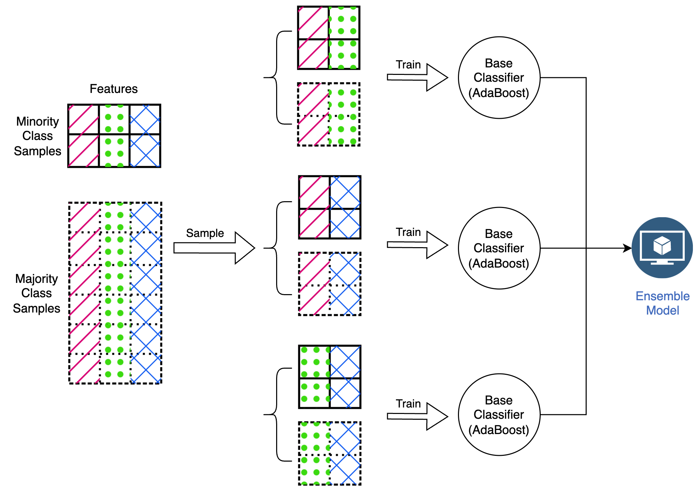
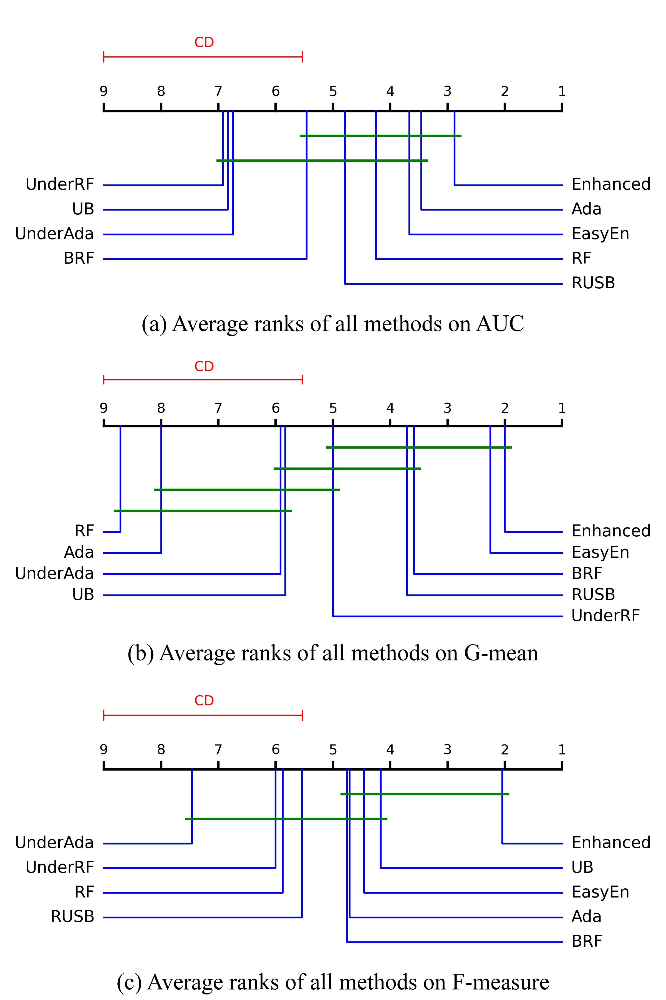
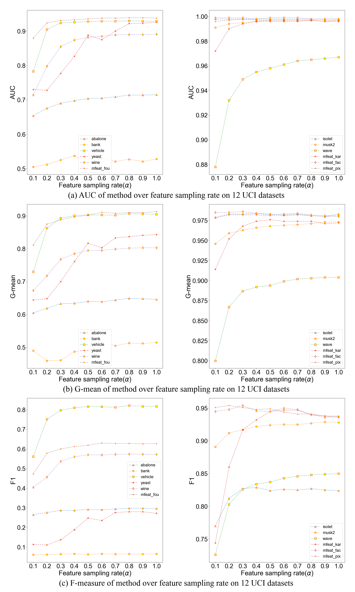

# EnhancedEnsemble
An enhanced ensemble framework for imbalance learning.
- Random Feature Subspace(RFS)
- Distance Weighted Under-Sampling(DWUS)

## Method
- randomly selects a feature subspace; 
- then weighted undersamples majority instances to create a balanced training subset; 
- finally trains base classifiers on multiple subsets and obtains the ensemble model.

Example of DWUS:

Overview of EnhanceEnsemble:

## Datasets

|Dataset|Size|Feature|Target|Ratio|
|:--:|:--:|:--:|:--:|:--:|
|Abalone|4177|10|11|7.6|
|Bank|7842|47|yes|7.5|
|Isolet|7797|617|1|25.0|
|Musk2|6598|166|1|5.5|
|Vehicle|845|18|van|3.3|
|Wave|5000|21|1|2.0|
|Wine|6497|11|7|5.0|
|Yeast|1484|8|ME2| 28.0|
|Mfeat-Fac| 2000| 216| 0| 9.0|
|Mfeat-Pix| 2000| 240| 0| 9.0|
|Mfeat-Kar| 2000| 64| 0| 9.0|
|Mfeat-Fou| 2000| 76| 0| 9.0|

## Metrics
- AUC
- G-mean
- F-measure

## Results
We compare our method `EnhancedEnsemble` with other 8 methods in terms of AUC, G-mean and F-measure on 12 UCI datasets.

## Ablation Study
- To quantify the individual contributions of DWUS and RFS in the `EnhancedEnsemble` framework, we design a controlled ablation study.

- Besides, we discover the sensitivity of α value across 12 datasets to reveal its importance for `EnhancedEnsemble`

## How to use
### Dependencies
- Python==3.12.7
- numpy==1.26.4
- pandas==2.2.2
- scikit-learn==1.5.1
- imbalanced-learn==0.12.3
- matplotlib==3.9.2

### Scripts
#### Core scripts
- `main.py`: main program. For every dataset, we perform ten times of five-fold cross validation
- `dataloader.py`: load UCI data, directly imported by python or downloaded locally
- `model.py`: define all the compared methods(9 methods)
- `sampler.py`: define the sampling strategy of datasets
- `dwus.py`: distance weighted under-sampling method

#### Auxiliary scripts
- `process_result.py`: post process experiments results that combines two kinds of datasets, find the best α value for `EnhancedEnsemble` and calculate the average values
- `plot_dwus_example.py`: plot the example of DWUS(by `sklearn.datasets.make_classification`)
- `plot_result_figure`: plot the result of ablation study
- `friedman_test.py`: generate the result of Friedman test and Nemenyi test
- `paired_t_test.py`: generate the result of paired t-test
